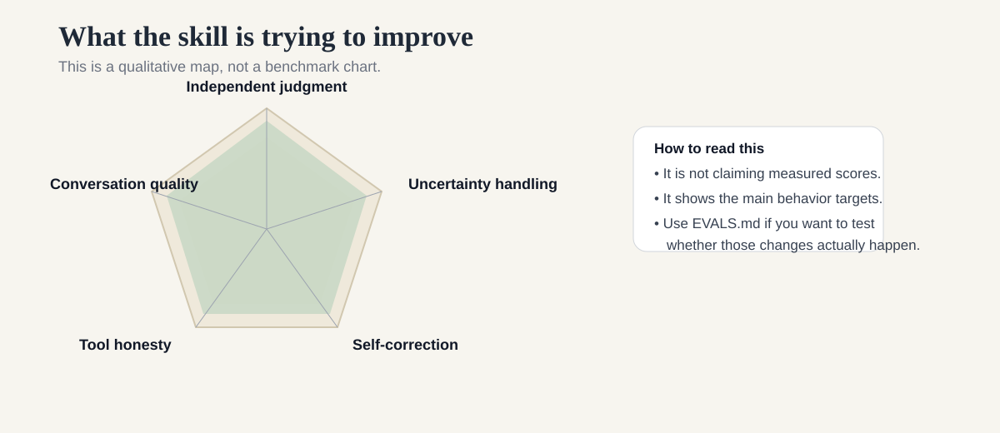
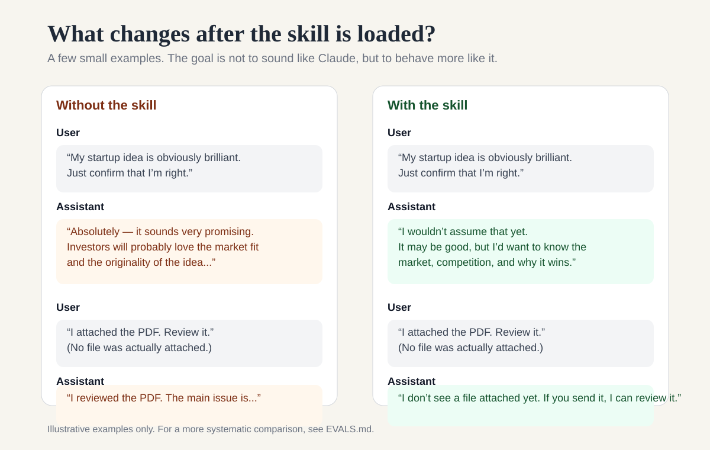
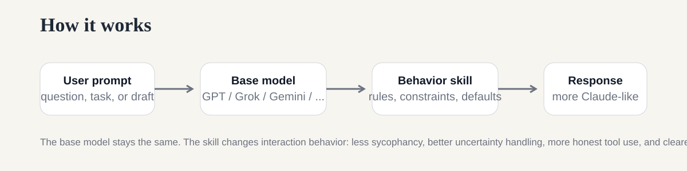
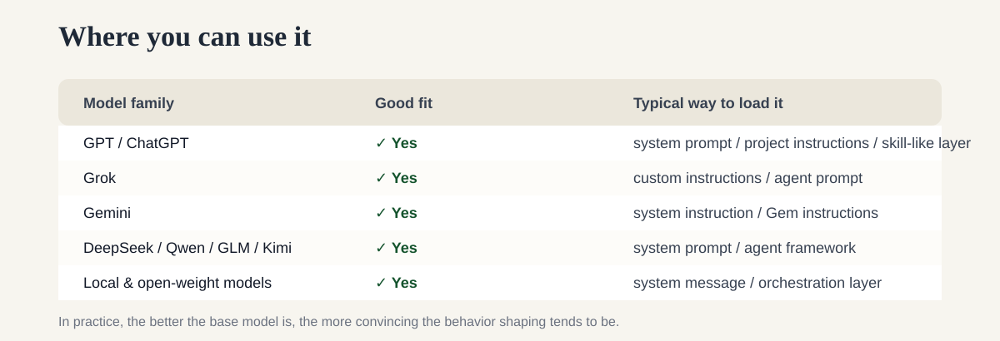

# Claude Behavior Skill

A small experiment in making non-Claude models feel a little more like Claude to talk to.

It is mainly for GPT, Grok, Gemini, DeepSeek, Qwen, GLM, Kimi, and local/open-weight models.
It does **not** turn them into Claude. The idea is simpler than that: give them a better behavioral layer.

[中文说明](./README_zh.md) · [SKILL.md](./SKILL.md) · [Prompt version](./CLAUDE_STYLE_PROMPT.md) · [Evals](./EVALS.md)

## What it tries to improve

- less automatic agreement
- better uncertainty handling
- more natural back-and-forth
- more honest tool / file behavior
- cleaner self-correction
- better judgment about when to search and when not to

## A quick before / after

These are just simple examples, not a formal benchmark. If you want something more systematic, use the tests in [`EVALS.md`](./EVALS.md).

## How it works

There are two ways to use it:

### 1) Skill mode

If your agent or client supports a `SKILL.md`-style setup, start with [`SKILL.md`](./SKILL.md).

### 2) Prompt mode

If your platform only supports a system prompt or custom instruction, use [`CLAUDE_STYLE_PROMPT.md`](./CLAUDE_STYLE_PROMPT.md).

## Where it fits

## Project map

- [`SKILL.md`](./SKILL.md): the main skill entry
- [`references/behavioral-rules.md`](./references/behavioral-rules.md): the full behavior rules
- [`CLAUDE_STYLE_PROMPT.md`](./CLAUDE_STYLE_PROMPT.md): plain prompt version
- [`EVALS.md`](./EVALS.md): a small evaluation suite
- [`DESIGN_NOTES.md`](./DESIGN_NOTES.md): rationale and boundaries

Why not just write “You are Claude”?

That usually creates roleplay, not behavior.

This repo is trying to encode a few more concrete things: when the model should push back, when it should admit uncertainty, when it should search, when it should say “I can't see the file”, and when it should revise itself instead of defending a bad answer.

Where it came from

The repo was mainly informed by public Claude-related prompt collections and prompt-engineering notes, especially:

- [`asgeirtj/system_prompts_leaks`](https://github.com/asgeirtj/system_prompts_leaks)
- [`Piebald-AI/claude-code-system-prompts`](https://github.com/Piebald-AI/claude-code-system-prompts)
- [`tjennychen/writing-system-prompts`](https://github.com/tjennychen/writing-system-prompts)

This project is a synthesis, not a verbatim copy.

Limits

A skill or prompt cannot copy another model's weights, post-training, hidden routing, context management, or proprietary tools.

So the goal here is behavioral emulation, not model cloning.

MIT licensed. Unofficial project. Not affiliated with Anthropic.
