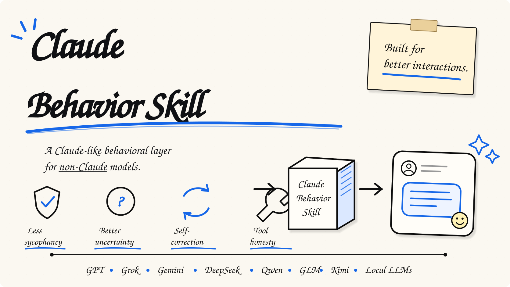

# Claude Behavior Skill

A small behavior layer for making non-Claude models feel a little more like Claude to talk to.

**GPT / Grok / Gemini / DeepSeek / Qwen / GLM / Kimi / local LLMs**

[中文](./README_zh.md) · [Skill](./SKILL.md) · [Plain prompt](./CLAUDE_STYLE_PROMPT.md) · [Evals](./EVALS.md)

<p align="center">
  <a href="https://github.com/huxiaoyi-ovo/claude-behavior-prompt/stargazers"></a>
  <a href="https://github.com/huxiaoyi-ovo/claude-behavior-prompt/forks"></a>
  <a href="https://github.com/huxiaoyi-ovo/claude-behavior-prompt/issues"></a>
  
  <a href="./LICENSE"></a>
</p>

<p align="center">
  
</p>

Many “Claude-style” prompts mainly copy the tone. This repo is more interested in the decisions underneath it: when to disagree, when to stay uncertain, when to search, when to admit a tool or file is unavailable, and when to correct an earlier answer.

## Quick start

**If your agent supports skills:** install this repository as a skill bundle so `SKILL.md` and `references/` stay together.

**If it only supports system/custom instructions:** use [`CLAUDE_STYLE_PROMPT.md`](./CLAUDE_STYLE_PROMPT.md).

Then just talk to the model normally. A trigger can be as simple as:

```text
Switch to Claude mode for this conversation.
```

## What changes

| Situation | Common failure mode | With this skill |
| --- | --- | --- |
| The user sounds very confident | Follows the premise too readily | Checks the premise before agreeing |
| Evidence is incomplete | Gives a cleaner conclusion than the evidence supports | Keeps uncertainty visible |
| A file/tool is unavailable | Infers more than it should | Says clearly what it cannot access |
| An earlier answer was wrong | Tries to preserve the previous answer | Corrects it directly |
| The question depends on fresh information | Answers from memory | Looks it up when tools are available |
| The task is simple | Over-explains | Keeps the answer short unless depth is useful |

That table describes the intended behavior, not benchmark results. For actual testing, see [`EVALS.md`](./EVALS.md).

## Why a skill?

Because “act like Claude” usually changes the **voice** more than the **judgment**.

The skill separates a small activation layer from the full behavior rules, so an agent can load the detailed instructions only when needed:

```text
SKILL.md
└── references/
    └── behavioral-rules.md
```

For platforms without a skill system, the same behavior is also available as a plain system prompt.

## Supported models

The rules are model-agnostic. They are mainly intended for:

`GPT / ChatGPT` · `Grok` · `Gemini` · `DeepSeek` · `Qwen` · `GLM` · `Kimi` · `local/open-weight models`

Results still depend heavily on the base model and the host platform.

## Files

- [`SKILL.md`](./SKILL.md) — skill entry point
- [`references/behavioral-rules.md`](./references/behavioral-rules.md) — full behavior rules
- [`CLAUDE_STYLE_PROMPT.md`](./CLAUDE_STYLE_PROMPT.md) — plain prompt version
- [`EVALS.md`](./EVALS.md) — behavior checks
- [`SOURCES.md`](./SOURCES.md) — source lineage and evidence notes
- [`DESIGN_NOTES.md`](./DESIGN_NOTES.md) — design notes and limits

<details>
<summary>Sources</summary>

The behavior rules were distilled from public Claude-related prompt collections and prompt-engineering projects, especially:

- [`asgeirtj/system_prompts_leaks`](https://github.com/asgeirtj/system_prompts_leaks)
- [`Piebald-AI/claude-code-system-prompts`](https://github.com/Piebald-AI/claude-code-system-prompts)
- [`tjennychen/writing-system-prompts`](https://github.com/tjennychen/writing-system-prompts)

This repo is a rewritten, portable synthesis rather than a verbatim copy. See [`SOURCES.md`](./SOURCES.md) for the provenance caveats.

</details>

<details>
<summary>Limits</summary>

A skill or prompt cannot copy Claude's weights, post-training, hidden routing, context management, inference-time compute, or proprietary tools.

The goal here is behavioral emulation, not model cloning.

</details>

## Contributors

<a href="https://github.com/huxiaoyi-ovo/claude-behavior-prompt/graphs/contributors">
  
</a>

MIT licensed. Unofficial project. Not affiliated with Anthropic.
