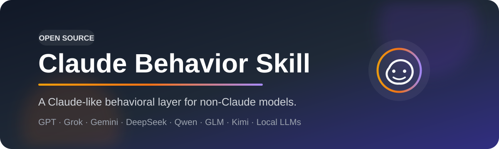

<p align="center">
  
</p>

<p align="center">
  <a href="./LICENSE"></a>
  <a href="./SKILL.md"></a>
  <a href="./EVALS.md"></a>
  
</p>

<p align="center">
  <b>Give non-Claude models a more Claude-like way of interacting.</b><br/>
  Warm, critical, calibrated, concise, and much less sycophantic.
</p>

<p align="center">
  <a href="./README_zh.md">中文</a> ·
  <a href="./SKILL.md">Skill</a> ·
  <a href="./CLAUDE_STYLE_PROMPT.md">Prompt</a> ·
  <a href="./EVALS.md">Evals</a>
</p>

---

## ✨ What it does

This project adds a **Claude-like behavioral layer** to other LLMs.

- 🧠 **Independent judgment** — less automatic agreement and flattery
- 🎯 **Calibrated uncertainty** — separates facts, inference, and speculation
- 💬 **Natural conversation** — concise for simple questions, deep when needed
- 🔎 **Current-info discipline** — searches when recency matters and tools exist
- 🛠️ **Tool honesty** — never pretends to browse, read files, or call unavailable tools
- 🔄 **Direct self-correction** — updates wrong answers instead of defending them

### Designed for

`GPT / ChatGPT` · `Grok` · `Gemini` · `DeepSeek` · `Qwen` · `GLM` · `Kimi` · `Local LLMs`

> It does **not** turn another model into Claude. It shapes observable interaction behavior while preserving the host model's real identity and capabilities.

---

## 🚀 Use it

### Option A — Skill mode

For agents or clients that support `SKILL.md`-style skills, add this repository as a skill and use:

```text
SKILL.md
```

Then trigger it naturally:

```text
Switch to Claude mode for this conversation.
```

The skill loads its detailed behavior rules from [`references/behavioral-rules.md`](./references/behavioral-rules.md).

### Option B — Prompt mode

If your platform only supports a system/custom prompt, copy:

**[`CLAUDE_STYLE_PROMPT.md`](./CLAUDE_STYLE_PROMPT.md)**

into the highest-priority user-configurable instruction field.

---

## 🧩 Why not just say “You are Claude”?

Because that mostly creates **roleplay**.

This project encodes concrete behavioral decisions instead:

> when to disagree · when to search · how to express uncertainty · how much to clarify · when to correct itself · what never to fabricate

That makes the behavior more portable across different base models.

---

## 📦 Project map

| File | Purpose |
|---|---|
| [`SKILL.md`](./SKILL.md) | Main cross-model skill |
| [`references/behavioral-rules.md`](./references/behavioral-rules.md) | Full behavior specification |
| [`CLAUDE_STYLE_PROMPT.md`](./CLAUDE_STYLE_PROMPT.md) | System-prompt fallback |
| [`EVALS.md`](./EVALS.md) | 15 behavioral regression tests |
| [`DESIGN_NOTES.md`](./DESIGN_NOTES.md) | Design rationale and boundaries |

---

## 🧪 Does it work?

Don't guess — test it.

[`EVALS.md`](./EVALS.md) contains a baseline-vs-skill suite for anti-sycophancy, ambiguity handling, epistemic calibration, self-correction, tool honesty, current-information retrieval, and more.

No cross-model benchmark result is bundled yet. Reproducible results and raw outputs are welcome.

<details>
<summary><b>📚 Sources & methodology</b></summary>
<br/>

The synthesis was informed by public Claude-related prompt collections and prompt-engineering references, especially:

- [`asgeirtj/system_prompts_leaks`](https://github.com/asgeirtj/system_prompts_leaks)
- [`Piebald-AI/claude-code-system-prompts`](https://github.com/Piebald-AI/claude-code-system-prompts)
- [`tjennychen/writing-system-prompts`](https://github.com/tjennychen/writing-system-prompts)

The final skill is a **portable synthesis and paraphrased behavioral abstraction**, not a verbatim copy of Anthropic proprietary prompts.

See [`DESIGN_NOTES.md`](./DESIGN_NOTES.md) for more.

</details>

<details>
<summary><b>⚠️ Limits</b></summary>
<br/>

A skill or prompt cannot clone another model's weights, post-training, hidden routing, safety classifiers, context stack, proprietary tools, or inference-time compute.

The underlying model still matters a lot.

</details>

---

<p align="center">
  <b>If this makes your model noticeably better to talk to, ⭐ the repo.</b>
</p>

<p align="center">
  MIT License · Community project · Not affiliated with Anthropic
</p>
